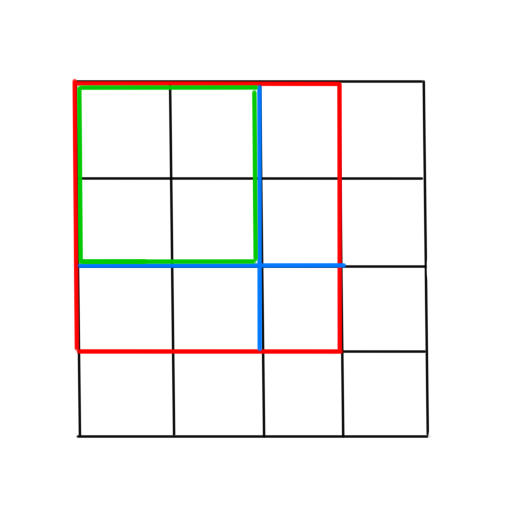
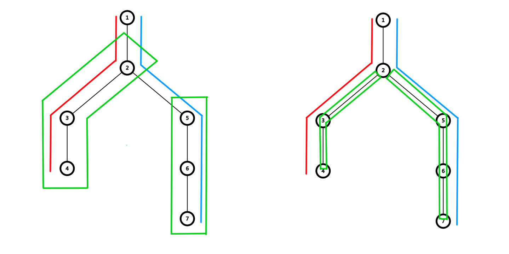

# 前缀和及差分

## 前缀和

### 一维前缀和

#### 定义

一维前缀和，就是数组前若干项的和。

我们对于前缀和数组的定义非常广泛，

例如定义 $S(x)$ 表示数组 $A(x)$ 的前缀和，

定义 $A(l,r)$ 表示 $A(l)+A(l+1)+\dots+A(r)$，

+ $S(x)=A(0,x)$；

+ $S(x)=A(1,x)$；

+ $S(x)=A(1,x-1)$；

+ $S(x)=A(0,x-1)$。

都是可以的，只不过我们一般用前两个。

#### 实现

我们可以枚举每一个元素，用，

$$
S(x)=\sum_{i=1}^xA(i)
$$

表示前缀和，那么有递推式，

$$
S(x)=S(x-1)+A(x),S(0)=0
$$

这是显然的。

C++ 语言中自带的前缀和函数为 `std::partial_sum`，

+ 形如：`partial_sum(begin, end, dist)`，
+ 表示 `[begin, end)` 的前缀和放在 dist 开始的位置，
+ 返回终止迭代器。

=== "实现 1"

    最经典的方法，

    ```cpp
    for (int i = 1; i <= n; ++i)
        S[i] = S[i - 1] + A[i];
    ```

    这种方法会保留原数组的内容。

=== "实现 2"

    我们在原数组直接进行操作，

    ```cpp
    for (int i = 1; i <= n; ++i)
        A[i] += A[i - 1];
    ```

    这种方法不会保留原数组的内容，但是省空间。

=== "实现 3"

    冷知识，

    ```cpp
    for (int i = 1; i < n; ++i)
        A[i + 1] += A[i];
    ```

    的速度要比前一个略快，因为编译器对前一个的优化是不到位的。

    这个问题在 GCC 12 修复，NOI-Linux 中的 GCC 9 是未修复的版本[^ref1]。

[^ref1]: 参考 2024 国家集训队论文 宋佳兴《论现代硬件上的常数优化》。

=== "实现 4"

    使用 STL 函数，

    ```cpp
    partial_sum(A + 1, A + n + 1, A + 1);
    ```

    进行原地的前缀和。

#### 应用

我们可以利用一维前缀和，进行不带修的 $\mathcal O(1)$ 区间求和。

具体的，

$$
S(l,r)=S(r)-S(l-1)
$$

这是显然的。

另外，修改复杂度为 $\mathcal O(n)$，一般不会使用。

如果要修改，一般会配合概率相关，

如果进行 $m$ 次操作，每次操作修改的概率是 $1/n$，

那么就可以进行 $\mathcal O(n)$ 的修改，因为这样均摊的复杂度依旧是 $\mathcal O(m)$ 的。

### 二维前缀和

#### 定义

我们直接取比较常见的定义，

$$
S(x,y)=\sum_{i\le x}\sum_{j\le y}A(i,j)
$$

几何意义就是，将二维平面划分为网格，建立平面直角坐标系。



那么，其前缀和平面的每一个点表示的就是，

从原点（此处是 $(1,1)$）到这个点的矩形的权值和。

#### 实现

那么可以容斥解决，

$$
S(x,y)=A(x,y)+S(x-1,y)+S(x,y-1)-S(x-1,y-1)
$$

这么做是最直观的。

#### 应用

不带修子区间求和问题，具体的，

$$
S(a,b,c,d)=S(c,d)-S(c,b-1)-S(a-1,d)+S(a-1,b-1)
$$

同样修改复杂度是 $\mathcal O(n^2)$ 的重构。

### 高维前缀和

#### 定义

代数表示为，

$$
S(x_1,x_2\dots,x_k)=\sum_{i_1\le x_2}\sum_{i_2\le x_2}\dots\sum_{i_k\le x_k}A(i_1,i_2,\dots,i_k)
$$

一般只有三维前缀和是具有直观的几何意义的，但是我们也不去讨论。

#### 实现

假设我们要求边长为 $n$ 的 $k$ 维超正方体的前缀和，

那么，如果继续使用容斥原理，复杂度将是 $\mathcal O(n^k2^k)$ 的，也就是说项数为 $2^k$ 的。

这显然是难以接受的（在 $3$ 维中就有 $8$ 项，这是很恐怖的）。

但是，我们有一个类似 DP 的求解高维前缀和的方法，我们下面仅以 $3$ 维为例。

我们先枚举每一个维度，然后对这个维度下进行前缀和，那么复杂度就是 $\mathcal O(n^kk)$ 的。

尽管这个复杂度依然很大，但是一般来说我们很少讨论 $4$ 维以上的前缀和，因此还是凑合的。

板子题：[AtCoder - abc366_d - Cuboid Sum Query](https://atcoder.jp/contests/abc366/tasks/abc366_d)。

???+ note "实现"
    ```cpp
    // 读入
    for (int i = 1; i <= n; ++i)
        for (int j = 1; j <= n; ++j)
            for (int k = 1; k <= n; ++k)
                cin >> s[i][j][k];
    // 将第一维前缀和
    for (int i = 1; i <= n; ++i)
        for (int j = 1; j <= n; ++j)
            for (int k = 1; k <= n; ++k)
                s[i][j][k] += s[i - 1][j][k];
    // 将第二维前缀和
    for (int i = 1; i <= n; ++i)
        for (int j = 1; j <= n; ++j)
            for (int k = 1; k <= n; ++k)
                s[i][j][k] += s[i][j - 1][k];
    // 将第三维前缀和
    for (int i = 1; i <= n; ++i)
        for (int j = 1; j <= n; ++j)
            for (int k = 1; k <= n; ++k)
                s[i][j][k] += s[i][j][k - 1];
    ```

#### 应用

高维子超立方体求和，我们发现式子会很复杂，

于是我们依然类似 DP 的，将每一个维度拆分考虑。


???+ note "实现"
    依旧以上一题的三维为例，我们使用 C++ 的函数重载特性，

    ```cpp
    int query(int x, int y, int z) {
        return s[x][y][z];
    }

    // 拆分第三维
    int query(int x, int y, int lz, int rz) {
        return query(x, y, rz) - query(x, y, lz - 1);
    }

    // 拆分第二维
    int query(int x, int ly, int ry, int lz, int rz) {
        return query(x, ry, lz, rz) - query(x, ly - 1, lz, rz);
    }

    // 拆分第一维
    int query(int lx, int rx, int ly, int ry, int lz, int rz) {
        return query(rx, ly, ry, lz, rz) - query(lx - 1, ly, ry, lz, rz);
    }
    ```

这就比较好理解了。

## 差分

### 一维差分

#### 定义

我们定义 $D$ 为 $A$ 的差分，即，

$$
D(x)=A(x)-A(x-1)
$$

对于一个长度为 $n$ 的序列 $A[1,n]$，有，

$$
D(x)=\begin{cases}
A(x)-A(x-1)&x\in[2,n]\\
A(x)&x=1
\end{cases}
$$

性质：

+ 数组 $A$ 的前缀和 $S$ 的差分是 $A$；

+ 数组 $A$ 的差分 $D$ 的前缀和是 $A$。

即，差分与前缀和互为逆运算。

!!! note "构造性的理解"
    我们构造差分数组的过程，也可以构造性的来看：

    我们知道数组 $A$，求一个数组 $D$ 使得 $D$ 的前缀和是 $A$。

    考虑 $A(x)$ 的所有贡献，发现我们进行前缀和的时候就会对它及其后面所有数造成贡献。

    因此，我们对于 $A(x)$，进行操作，

    $$
    \begin{aligned}
    D(x)&\gets D(x)+A(x)\\
    D(x+1)&\gets D(x+1)-A(x)
    \end{aligned}
    $$

    那么进行前缀和的时候就会消去多余的贡献了。

    然后再反过来考虑每一个 $D(x)$ 受到了什么贡献，容易发现就是，

    $$
    D(x)=A(x)-A(x-1)
    $$

    这就是一种构造性的理解。

C++ 中也有差分的函数 `std::adjacent_difference`，

+ 形如：`adjacent_difference(begin, end, dist)`，
+ 表示 `[begin, end)` 对相邻两项的差值，
+ 放在 `dist + 1` 开始的位置，返回终止迭代器。

#### 应用

类似上文构造性的方法，我们可以利用差分数组，进行 $\mathcal O(1)$ 的区间加，$\mathcal O(n)$ 的单点查询：

+ 对 $[l,r]$ 加上 $x$：令 $D(l)\gets D(l)+x,D(r+1)\gets D(r+1)-x$；

+ 查询：对数组跑一遍前缀和，发现多余的贡献都被消除了，那么就可以直接访问。

### 二维差分

#### 定义

我们可以直接定义 $D$ 为 $A$ 的二维差分，当且仅当 $D$ 的二维前缀和为 $A$。

考虑构造，我们发现只需要令，

$$
\begin{aligned}
D(x,y)&\gets D(x,y)+A(x,y)\\
D(x+1,y)&\gets D(x+1,y)-A(x,y)\\
D(x,y+1)&\gets D(x,y+1)-A(x,y)\\
D(x+1,y+1)&\gets D(x+1,y+1)+A(x,y)
\end{aligned}
$$

这样子就是正确的。

#### 应用

类似一维，可以进行 $\mathcal O(1)$ 的子矩阵加，$\mathcal O(n^2)$ 的单点查询。

具体略。

## 树上问题

一般讨论点权和边权。



对于边权通常比较难处理，会下方到点权，下文所说边权均为下放到点权后的。

### 树上前缀和

设 $S(u)$ 表示从根到节点 $u$ 经过的所有权值和。

设 $S(x,y)$ 表示 $x\to y$ 路径上的权值和，

+ 若是点权，$S(x,y)=S(x)+S(y)-S(\mathrm{LCA})-S(\mathrm{fa_{LCA}})$；

+ 若是边权，$S(x,y)=S(x)+S(y)-2S(\mathrm{LCA})$。

### 树上差分

树上差分可以用于在树上快速修改然后统一查询。

一般我们会对一条链进行操作，假设我们对 $x\to y$ 路径上的权值进行修改，

+ 若是点权，我们对 $x,y$ 加 $1$ 倍，对 $\mathrm{LCA}$ 减 $1$ 倍，对 $\mathrm{fa_{LCA}}$ 减 $1$ 倍即可。

+ 若是边权，我们对 $x,y$ 加 $1$ 倍，对 $\mathrm{LCA}$ 减 $2$ 倍即可。

## 其他前缀

### 前缀积

我们设，

$$
P(x)=\prod_{i=1}^xA(i)
$$

前缀积一般是满足可差分性的，但是取模后就不一定了。

例如，在某一处的前缀积关于模数不存在乘法逆元的情况。

我们只讨论满足可差分性的，那么有，

$$
P(l,r)=\frac{P(r)}{P(l-1)}
$$

特殊的，我们定义 $P(0)=1$。

可以用于求一段区间的乘积，但是不常用，因为乘大了自然需要取模。

### 前缀最大最小值

以最大值为例。

我们设，

$$
M(x)=\max_{i=1}^xA(i)
$$

这显然不满足可差分性，因此不能求区间的结果。

但是依然应用很广泛。

### 前缀异或和

我们设，

$$
R(x)=\bigoplus_{i=1}^xA(i)
$$

其中 $\oplus$ 运算符表示按位异或 $\operatorname{xor}$ 运算。

注意到这是满足可差分性的，因为 $x\operatorname{xor}x=0$，因此，

$$
R(l,r)=R(r)\bigoplus R(l-1)
$$

这个也存在应用。

还有一些好玩的详见异或哈希算法。
