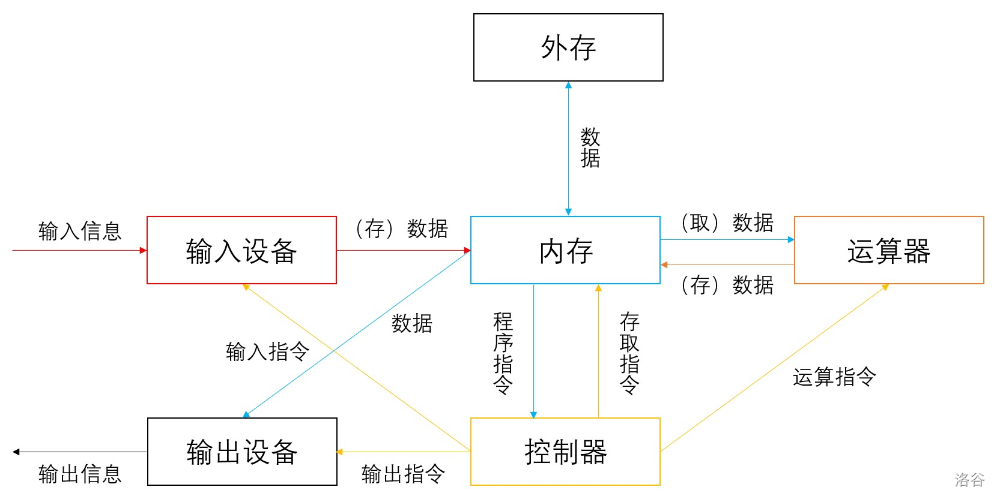
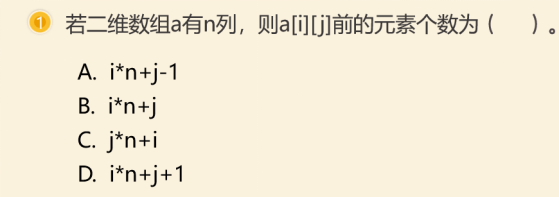
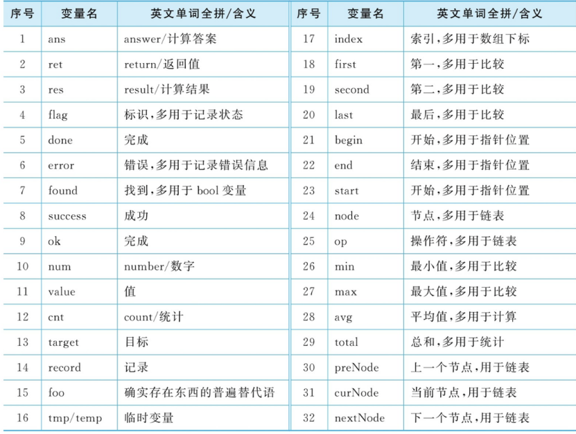
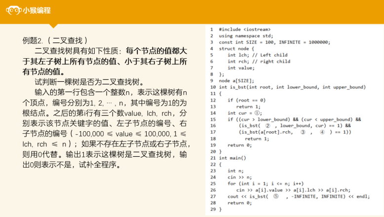

# 初赛知识点汇总

## 计算机基础知识

### 计算机设备结构



存储器访问速度：寄存器 $>$ 高速缓存 $>$ 内存（ROM + RAM）$>$ 外存，断电仅保留 ROM 和外存中的数据。

### ASCII 码

$\texttt{ASCII}$ 码（$\texttt{American Standard Code for Information Interchange}$）是美国国家交换标准代吗。

| 码域 | 字符 | 可见性 |
| :-: | :-: | :-: |
| $0 \sim 31$，$127$ | 控制字符或通信专用字符 | $\texttt{False}$ |
| $32$ | 空格 | $\texttt{False}$ 或 $\texttt{True}$ |
| $48 \sim 57$ | 数字（$\texttt{0} \sim \texttt{9}$） | $\texttt{True}$ |
| $65 \sim 90$ | 大写字母（$\texttt{A} \sim \texttt{Z}$） | $\texttt{True}$ |
| $97 \sim 122$ | 小写字母（$\texttt{a} \sim \texttt{z}$） | $\texttt{True}$ |
| 其他（$33 \sim 47$，$58 \sim 64$，$94 \sim 96$，$126$） | 特殊字符 | $\texttt{True}$ |
| 拓展（$128 \sim 255$） | 拓展的 $\texttt{ASCII}$ 码 | $\texttt{N/A}$ |

### 机器数与真值

正数：［原码 $=$ 反码 $=$ 补码］

负数：［反码 $=$ 除符号位外，原码的各位全部取反］［补码 $=$ 反码 $+1$］

### 逻辑表达式的右结合性

逻辑表达式：由逻辑运算组合而成，返回值只有 $\texttt{True}$ 和 $\texttt{False}$，其中 $0$ 表示假、非 $0$ 表示真。

如果逻辑表达式由多个组合，需要［从右往左］依次判断，最后得出答案。这种性质被称为［右结合性］。

例子：

> <表达式1>?<表达式2>:<表达式3>?<表达式4>:<表达式5>
> 执行的时候是从表达式 $3$ 开始判断是否为真，然后从右往左执行每一个表达式，依次向上回溯，最后得出答案。

### 图片与视频大小问题


## Linux 基础操作

### 文件操作

```
列出文件：ls
列出隐藏文件：ls -a
列出文件及大小：ls -l
重命名文件：mv old.cpp new.cpp
创建备份：cp file.cpp file.cpp.bak
查看目录地址：pwd
切换上级目录：cd ..
切换目录：cd dirx
创建目录：mkdir dirx
删除目录：rm -r dirx
```

### 程序操作

```
运行程序：./test
计时运行：time ./test
重定向输入输出：test<in.txt>out.txt
查看所有进程：ps
杀掉后台进程：killall test
终止进程：kill $pid
强制终止运行：Ctrl-C
输入结尾（EOF）：Ctrl-Z
```

### gcc 基础指令

```
生成调试信息：-g
生成目标文件：-c
生成可执行文件：-o
包含 cmath 库：-lm
显示警告：-Wall
缺氧、氧气优化：-O0，-O2
C++11/14：-std=c++11，-std=c++14
```

## 算法基础

### 复杂度分析

符号：$T(n)$ 表示时间复杂度，$T(n) = $ 后跟一个符号，例：$T(n) = \mathcal{O}(n^2)$。

| 符号 | 英文名称 | 意义 |
| :-: | :-: | :-: |
| $\Theta$ | `theta` | 等于 |
| $\mathcal{O}$ | `big-oh` | 小于等于 |
| $\Omega$ | `big-omega` | 大于等于（不常用） |
| $o$ | `small-oh` | 小于（不常用） |
| $\omega$ | `small omega` | 大于（不常用） |

详见：<https://oi-wiki.org/basic/complexity/>

### 排序算法

基于比较：通过比较元素来排序数列，如冒泡排序，快速排序等；

不基于比较：不比较元素，通过其他方法来进行排序，如基数排序等。

|  | 选择排序 | 冒泡排序 | 插入排序 | 快速排序 | 归并排序 |
| :------------: | :------------: | :------------: | :------------: | :------------: | :------------: |
| **平均复杂度** | $\mathcal{O}(n^2)$ | $\mathcal{O}(n^2)$ | $\mathcal{O}(n^2)$ | $\mathcal{O}(n \log n)$ | $\mathcal{O}(n \log n)$ |
| **最坏复杂度** | $\mathcal{O}(n^2)$ | $\mathcal{O}(n^2)$ | $\mathcal{O}(n^2)$ | $\mathcal{O}(n^2)$ | $\mathcal{O}(n \log n)$ |
| **最好复杂度** | $\mathcal{O}(n^2)$ | $\mathcal{O}(n)$ | $\mathcal{O}(n)$ | $\mathcal{O}(n \log n)$ | $\mathcal{O}(n \log n)$ |
| **稳定性** | 不稳定 | 稳定 | 稳定 | 不稳定 | 稳定 |
| 空间复杂度 | $\mathcal{O}(1)$ | $\mathcal{O}(1)$ | $\mathcal{O}(1)$ | $\mathcal{O}(n)$ | $\mathcal{O}(n)$ |

|  | 希尔排序 | 堆排序 | 基数排序 |
| :------------: | :------------: | :------------: | :------------: |
| **平均复杂度** | $\mathcal{O}(n^{1.3})$ | $\mathcal{O}(n \log n)$ | $\mathcal{O}(d \times (n + w))$ |
| **最坏复杂度** |  | $\mathcal{O}(n \log n)$ | $\mathcal{O}(d \times (n + w))$ |
| **最好复杂度** |  | $\mathcal{O}(n \log n)$ | $\mathcal{O}(d \times (n + w))$ |
| **稳定性** | 不稳定 | 不稳定 | 稳定 |
| 空间复杂度 | $\mathcal{O}(1)$ | $\mathcal{O}(1)$ | $\mathcal{O}(w)$ |

### 数据结构

详见：[https://www.luogu.com.cn/blog/334586/csp-pre-knowledge](https://www.luogu.com.cn/blog/334586/csp-pre-knowledge#:~:text=%E6%8D%AE%E7%BB%93%E6%9E%84-,%E6%95%B0%E6%8D%AE%E7%BB%93%E6%9E%84,-%E5%9B%BE%E8%AE%BA)

## 常用缩写

### 网络

* 局域网：$\texttt{LAN}$（$\texttt{Local Area Network}$），$\le 1 \text{ } \texttt{km}$，结构简单、范围小，短距离传输效率极高
* 城域网：$\texttt{MAN}$（$\texttt{Metropolitan Area Network}$），$1 \sim 10 \text{ } \texttt{km}$
* 广域网：$\texttt{WAN}$（$\texttt{Wide Area Network}$），$10 \sim 1000 \text{ } \texttt{km}$
* 万维网：$\texttt{WWW}$（$\texttt{World Wide Web}$），全球范围

### 其他协议

* 传输相关

	* 传输控制协议：$\texttt{TCP}$（$\texttt{Transmission Control Protocol}$）
	* 用户数据报协议：$\texttt{UDP}$（$\texttt{User Datagram Protocol}$）

* 应用相关

	* 超文本传输协议：$\texttt{HTTP}$（$\texttt{Hyper Text Transfer Prtcl}$）
	* 超文本传输协议：$\texttt{HTTPS}$（$\texttt{ - over Securesocket ayer}$），增加了传输加密和身份认证
	* 文件传输协议：$\texttt{FTP}$（$\texttt{File Transfer Protocol}$）
	* 对等网络：$\texttt{P2P}$（$\texttt{peer-t(w)o-peer}$）

* 邮件相关

	* 简单邮件传输协议：$\texttt{SMTP}$（$\texttt{Simple Mail Transfer Protocol}$）
	* 邮局协议 ：$\texttt{POP}$（$\texttt{Post Office Protocol}$）
	* 邮局协议第三版 ：$\texttt{POP3}$（$\texttt{Post Office Protocol - Version 3}$）
	* 交互邮件访问协议：$\texttt{IMAP}$（$\texttt{Internet Message Access Protocol}$）

### 计算机设备结构

* 随机存储器：$\texttt{RAM}$（$\texttt{Random Access Memory}$）
* 只读存储器：$\texttt{ROM}$（$\texttt{Read Only Memory}$）

## 数学问题

详见：[https://www.luogu.com.cn/blog/334586/csp-pre-knowledge](https://www.luogu.com.cn/blog/334586/csp-pre-knowledge#:~:text=%E6%95%B0%E5%AD%A6-,%E6%95%B0%E5%AD%A6,-%E6%9C%80%E5%A4%A7%E5%85%AC%E7%BA%A6%E6%95%B0)

### 排列组合

* 排列 $A(n, m)$，旧时写作 $P(n, m)$：

	$\displaystyle A(n, m) = \frac{n!}{(n - m)!}$

* 组合 $C(n, m)$，也写作 $\displaystyle \binom{n}{m}$：

	$\displaystyle C(n, m) = \frac{A(n, m)}{A(m, m)} = \frac{n!}{m!(n - m)!}$

* 错排列问题：

	$D_1 = 0$，$D_2 = 1$，$D_n = (n - 1)(D_{n - 1} + D_{n - 2})$

* Lucas 定理：

	$\displaystyle \binom{n}{m} = \binom{n \bmod p}{m \bmod p}\binom{n / p}{m / p}$，其中 $p$ 为质数

* Catalan 数：

	$\displaystyle C(n) = \binom{2n}{n} - \binom{2n}{n - 1} = \frac{1}{n + 1} \binom{2n}{n}$

* 二项式定理：

	$\displaystyle (x + y)^k = \sum_{i = 0}^{k} C(n, i) x^i y^{k - i}$

### 概率与统计

* 独立事件（即两事件的结果不会相互影响）：

	$P(A \cap B) = P(A) \times P(B)$

* 古典公式：

	$P(A) = \dfrac{|A|}{S}$

* 贝叶斯公式：

	$P(A \mid B) = \dfrac{P(A \cap B)}{P(B)}$

* 数学期望：

	$\displaystyle E(x) = \sum_{i = 1}^\infty x_i p_i$

### 线性代数

* 矩阵：

	

* 矩阵乘法 $O(nmr)$：

	设 $A = (a_{ij})_{n \times m}$，$B = (b_{ij})_{m \times r}$，
	设 $C = A \times B = (c_{ij})_{n \times r}$，
	则 $\displaystyle c_{ij} = \sum_{k = 1}^{m} a_{ik}b_{kj}$
	
	

### 方格路径

题目：有 $n \times m$ 的方格，从 $(1, 1)$ 出发，只能向右、下走，求走到 $(n, m)$ 的方案数。

1. 递推法

	每个格子可以从上面和右面转移过来，这是一个非常基础的 DP 问题：$f(i, j) = f(i - 1, j - 1) + f(i - 1, j)$.

2. 组合数学法

	$C(n + m - 2, n - 1)$ 或 $C(n + m - 2, m - 1)$.
	
	证明：一共要走 $n + m - 2$ 步，其中 $n - 1$ 个下，$m - 1$ 个右，随时都能向右走，证毕。

3. 扩展

	从 $(a, b)$ 走到 $(c, d)$，路径数为 $C(c - a + d - b, c - a)$ 或 $C(c - a + d - b, d - b)$.

### 其他

* 对数恒等式：

	*$\log_kn = \dfrac{\log_xn}{\log_xk}$

* 整数溢出：

	signed 溢出是 Undefined Behavior（UB），是否取会模取决于编译器；
	unsigned 溢出是 Define Behavior（DB），在溢出时自动取模。

* 模等式：

	* 对于 $m \bmod n = p$：
		* 若 $m > n$，则 $0 \le p <n$；
		* 若 $m = n$，则 $p = 0$；
		* 若 $m < n$，则 $p = m$；
	* 所以 $p \le \min(m, n)$

## 拿分技巧

以下大多来自学而思 <https://mp.weixin.qq.com/s/fk9B6pTA_33aZbHp8fcw9A>。

普通单选题就是一个题面一道题四个选项，主要是从五个方面来考察，分别是：计算机基础常识、C++ 语法、基本算法理论、数据结构、数学基础。本文主要详述一下这些题适用的拿分技巧，包括：排除法、特殊值代入法、极值法等，除此之外在一些代码题中也可以用模拟法，模拟法会在下文详述。

长篇代码题就是给一段代码，然后需要回答若干道与之相关的客观题，给出的代码可以是完好的（阅读程序题），也可以是残缺的（完善程序题）。对于这些题，我们能用的技巧有：模拟法、模仿相似代码法、相关变量法、经典算法实现、参考文字提示、特殊数据带入法、排除法、反例法等。

#### 排除法


这道题当年很多同学不敢肯定 A 是对的，但是呢，由于 BCD 错得离谱，所以就算你再不确定 A 是不是对的，由于其他选项都被排除了，也就只好选 A 了。

#### 极值法



本题是一个抽象的规律题，理论上对于任何符合条件的数，这个规律都能成立，故而我们可以代入一些极为特殊的数，从而能直接简化整个题目的难度等级，比如代入 $n = 1$，则数组被简化为 $1 \times 1$ 的数组，只有 $1$ 个元素：a[0][0]。

此时，这个元素的前面没有任何元素，即，有 $0$ 个元素。然后把 $i = 0$ 和 $j = 0$ 代入四个选项，能够快速得到 A 为 $-1$、D 为 $1$ 都是不符合题意的选项，均可以快速排除。至于 B 和 C 选项，我们只需要再代入一个稍复杂的矩阵（如 $3 \times 4$）的就能轻松解决问题~

在上述实操中，我们使用了一个特殊极值，将题目化简为了一个极为简单的情况（从二维变成了一维），从而快速排除掉一半的选项，将随机选择的正确率从 $25\%$ 一下就提高到了 $50\%$，这道题的原意本来是想考察我们对二维数组存储的理解深度，但是如果你对二维数组的了解不深，通过这种极值简化和排除的办法，也能极大提高得分概率。

#### 代入法


我们可以代入一些特殊的数据，来猜测什么样的数组合并时，比较次数最多，并算出最多的比较次数。

比如，如果是 a 数组 $[1, 2, 3]$ 和 b 数组 $[4, 5, 6]$ 两个数组，我们发现首先 $1$、$2$、$3$ 分别需要和 $4$ 比较一次后放入结果数组，然后由于 a 数组已经没有了可比较元素了，b 数组就直接按顺序放入结果数组即可，所以比较次数只需要 $3$ 次，即 n 次即可。

这样显然太顺利了，而题目问的是至多多少次，所以我们可以构造一个运气不太好的数组，如 a 为 $[1, 3, 5]$，b 为 $[2, 4, 6]$，这样 $1$ 需要和 $2$ 比较，然后放入结果数组，$2$ 需要和 $3$ 比较、$3$ 需要和 $4$ 比较等等。

以此类推，合并这两个数组需要比较 $5$ 次，咱们可以随意增大数组长度找规律，可知需要比较 $2n – 1$ 次。而且由于除了最后一个元素外，每个元素进数组前都要比较一次，比较得很充分，没有其他情况能比这种情况比的次数更多了，故而得到本题答案选 D。这样代入具体例子肯定比同学们在理论层面推要快，要直观，更不容易错，对吧？

#### 模拟法

若变量个数过多，或程序变化过于复杂，随手写的过程中容易稍不留神就出错时，则可以考虑设计表格来展示所有数据。模拟时，遇到常见的变量名和算法结构时，可以大胆地根据变量名、算法结构猜测其作用，再根据模拟的结果小心验证，这样能够提高做对的概率，并且极大减少我们模拟时的工作量~

常见的变量名如下：



对于常见的算法结构，大家可以重点关注一些算法的典型结构：二分、计数排序、连续字符判断（字符转数字）、链表、分治、二叉树等。此处限于篇幅就不详细列出每种结构了，请大家一定要对照代码，仔细总结。

虽然模拟法非常有用，但是比较依赖各位同学扎实的代码能力，对于非常复杂的题，代码能力弱的同学可能会模拟得非常吃力，还容易出错，所以下述技巧其实才是咱们“骗分”的主力！

#### 模仿相似代码法

在我们编写程序的时候，常常会出现相似度很高的代码，它们通常是对不同的对象做相同或者相似的处理。这种现象常常出现在枚举、分治或者树结构相关的程序上。当我们需要补全语句时，参考与它相似的段落往往会给我们带来很多提示和启发。

方法举例：



通过题目可知，本题代码考察的是二叉树结构。在代码里，你能发现相似的地方不？16行和17行的代码是比较相似的吧？从 $17$ 行的 `a[root].rch` 来看，我们不难猜出，这里应该是要遍历它的右子树，那么 $16$ 行应该是要遍历什么呢？自然是左子树，所以标号为 ② 这个空的答案呼之欲出：自然是 `a[root].lch`。

通过 $16$ 行可知，左子树的范围是 `lower_bound` 到 `cur`，那么 ③④ 空右子树的范围是啥呢？肯定从 `cur` 左右开始，到 `upper_bound`。为啥是 `upper_bound` 呢？因为一查字典就知道，`lower_bound` 是下界（下限/最小值），所以与之对应的词，习惯上一般称为 `upper_bound`（上界）。经过此番严谨而大胆的猜测后，下面的几题你会选了么？

当然，你要是觉得用技巧的猜测过于大胆了，不放心的话，在时间富裕的情况下，可以再用模拟法代入具体数值小心验证一下。

#### 经典算法实现

很多题目，特别是完善程序题的题目都会涉及到一个或多个具体的算法，而很多算法是有明显的经典代码特色的。因此，咱们可以利用算法本身约定俗成的写法就能快速解题！

方法举例：


本题的 $1$、$2$ 空一看就是在求所有的约数，结合题目要求复杂度为 $O(\sqrt n)$，我们根据过往求解因数个数等的模板可知，$1$ 空为 `i * i`（因为约数是成双成对的，找到 $\sqrt n$ 就行了），$2$ 空为 `n / i`，这是为了避免完全平方数有一个无法成对的约数情况（如，$36$ 的约数 $6$ 没有与之配对的不同的约数了）。

本题的 $3$、$4$ 空根据函数名和题目描述可知，其作用是求最大公约数的函数，结合题目要求复杂度为 $O(\log \max(a, b))$，不难发现，这是考辗转相除法的递归版本，所以 $3$ 为 `return a`、$4$ 为 `a % b`。

#### 反例法

此方法通常用在判断题里，根据题目给的条件，只要能举出一个反例，那么题目所描述的内容就会不成立。

方法举例：

比如，题目说：数组 a[i] 必须全为正整数，否则程序将选入死循环。那我们就可以将 $0$ 或者负整数代入 a 数组，看看会不会死循环，只要能找到一个反例，那么这道题的描述的情况就不成立。当然，由于只需要找到一个反例，所以我们可以代入尽可能简单的数，比如 $0$ 或 $-1$，这样就能快速算出答案。
