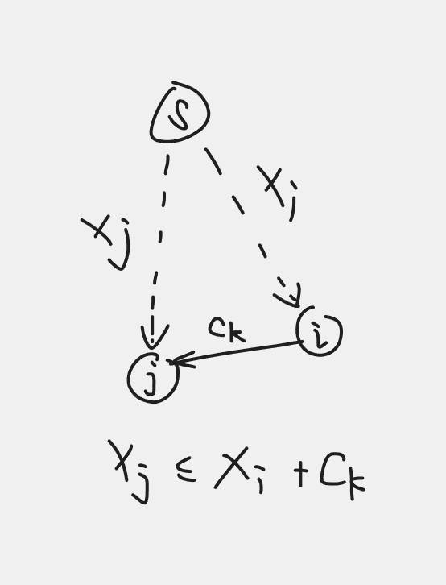

# 差分约束系统

## 定义

**差分约束系统**是一种特殊的 $n$ 元一次不等式组：

- 包含 $n$ 个变量 $x_1,x_2,\dots,x_n$；
- 包含 $m$ 个约束条件，形如 $x_i-x_j \le c_k$，其中 $1 \le i, j \le n, i \neq j$。

我们被要求求一组解，或者判断无解。

## 思想

如图：

最原始的约束条件形如 $x_i-x_j \le c_k$，我们可以将其等价变形为 $x_i\leq x_j+c_k$，注意到这与**三角形不等式**非常相似，因此我们可以将整个不等式组看做一个图，在图上跑最短路：

- 对于 $x_i-x_j \le c_k$：
- 将变量 $x_i,x_j$ 看为节点，将 $c_k$ 看为边权，
- 那么我们就可以：从 $j$ 向 $i$ 连一条边权为 $c_k$ 的边。

此时当我们在图上跑出最短路的结果 $\mathit{dis}_k$ 即为 $x_k$ 的一个特解，记为 $\{a_1,a_2,\dots,a_n\}$。

容易知道，通解可以表示为：$\{a_1+d,a_2+d,\dots,a_n+d\}$ 也是该差分约束系统的一组解，因为这样做差后 $d$ 恰好被消掉。

我们建一个超级源点 $\mathit{rt}$ 并从 $\mathit{rt}$ 开始跑最短路，注意到边权有可能非负，于是我们跑 SPFA。

如果我们被要求判断是否存在解，也可以使用栈优化的 Bellman–Ford。

## 常见套路

我们的原型形式为 $x_i-x_j\le c_k$，然而大部分时候，题目给出的并不是这个形式（有可能更加复杂）。

于是我们需要转换：

| 题意 | 转化 | 连边 |
| :-: | :-: | :-: |
| $x_i-x_j\le c$ | $x_i-x_j\le c$ | `add(j, i, c)` |
| $x_i-x_j\ge c$ | $x_j-x_i\le -c$ | `add(i, j, -c)` |
| $x_i-x_j=c$ | $x_i-x_j\le c,x_i-x_j\ge c$ | `add(j, i, c), add(i, j, -c)` |
| $x_i=x_j$ | $x_i-x_j\le 0,x_i-x_j\ge 0$ | `add(j, i, 0), add(i, j, 0)` |
| $x_i/x_j\le c$ | $\log x_i-\log x_j\le \log c$ | `add(log(j), log(i), log(c))` |

常见安排位置问题，可能需要注意 $x_i-x_{i-1}\ge1$ 这种坑点。

## 练习题

见：<https://www.luogu.com.cn/training/418255>
