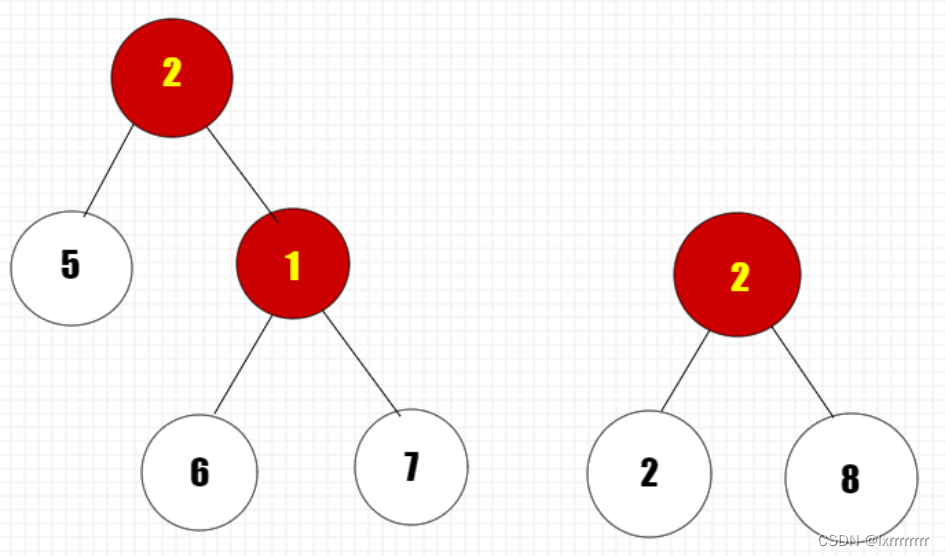

# Kruskal 重构树

> 最大生成树将部分内容倒置即可

## 回顾：Kruskal

### 基本信息

1. 求解最小生成树
2. 时间复杂度：$O(m \log m)$
3. 更适合稀疏图

### 算法思想

1. 按照边权从小到大排序
2. 依次枚举每一条边，如果这一条边两侧不连通，则加入这条边

### 代码

<details>
<summary>点击查看代码</summary>

```cpp
const int N = 200010;

int f[N];

struct Edge
{
    int a, b, w;
    bool operator<(const Edge &W) const { return w < W.w; }
} g[N];

int find(int x) { return x == f[x] ? x : find(f[x]); }

int main()
{
    int n = rr, m = rr;

    int a, b, w;
    for (int i = 0; i < m; ++i)
        a = rr, b = rr, w = rr, g[i] = {a, b, w};

    sort(g, g + m);

    for (int i = 1; i <= n; ++i)
        f[i] = i;

    int res = 0, cnt = 0;
    for (int i = 0; i < m; ++i)
    {
        int a = find(g[i].a), b = find(g[i].b), w = g[i].w;
        if (a != b)
            f[a] = b, res += w, ++cnt;
    }

    cnt < n - 1 ? printf("impossible\n") : printf("%d\n", res);
    return 0;
}
```
</details>

## Kruskal 重构树

### 算法思想

在构建最小生成树的时候，设现在枚举到了一条要加入最小生成树的边 $(u, v, w)$：

则在 Kruskal 重构树中，构建一个点权为 $w$ 的虚点，编号为 $t$，同时连边 $(u, t)$、$(v, t)$。

### 主要性质

1. 重构树是一棵［二叉树］；
2. ［子节点的点权］小于［父节点的点权］（即大根堆）；
3. 最小生成树上［两点之间的最大边权］等于重构树上［两点之间的最大边权］（即为重构树上两点 LCA 的点权）。

### 结论证明

最小生成树上两点间最大边权等于重构树上两点 LCA 的点权，证明：

1. 后加入的边权一定小于先加入的边权，所以重构树一定自上到下点权不减；
2. 两点在最小生成树上的路径的所有边一定都在重构树上两点之间；
3. 所以两点在最小生成树上之间的最长边权一定是重构树上两点 LCA 的点权。

如图：



其中红色的点表示虚点，中间的数字表示其点权；白色的点表示原有的点。

## 代码

```cpp
// INPUT GRAPH
const int N = 2e5 + 10;
const int M = 2e5 + 10;

// NEW GRAPH
const int NN = N + M;
const int MM = M + M;

// 4LCA
const int K = 20;

// NODE, EDGE, QUERY
int n, m, q;

// INPUT GRAPH
struct e
{
    int u, v, w;
    bool operator<(const e &t) const { return w < t.w; }
} g[M];

// UNOIN
int f[NN];
int find(int x) { return x == f[x] ? x : f[x] = find(f[x]); }

// NEW GRAPH
int d[NN], cnt;
int h[NN], e[MM], ne[MM], idx;

// 4LCA
int depth[NN];
int up[NN][K];

// ADD TO NEW GRAPH
inline void _add(int u, int v)
{
    e[idx] = v;
    ne[idx] = h[u];
    h[u] = idx++;
}

void add(int a, int b, int w)
{
    d[++cnt] = w;
    f[a] = f[b] = cnt;
    _add(a, cnt), _add(cnt, a);
    _add(b, cnt), _add(cnt, b);
}

// LCA INIT
void init(int u, int fa)
{
    depth[u] = depth[fa] + 1;
    for (int i = 1; i < K; ++i)
        up[u][i] = up[up[u][i - 1]][i - 1];

    for (int i = h[u]; i != -1; i = ne[i])
    {
        int v = e[i];
        if (v == fa)
            continue;
        up[v][0] = u, init(v, u);
    }
}

// KRUSKAL
int kruskal()
{
    sort(g + 1, g + 1 + m);

    for (int i = 1; i <= n * 2; ++i)
        f[i] = i;

    cnt = n;
    memset(h, -1, sizeof h);

    int res = 0;
    for (int i = 1; i <= m; ++i)
    {
        int u = find(g[i].u), v = find(g[i].v), &w = g[i].w;
        if (u == v)
            continue;
        res += w, add(u, v, w);
    }

    init(cnt, 0);
    return res;
}

// LCA
int lca(int x, int y)
{
    if (depth[x] < depth[y])
        swap(x, y);

    for (int i = K - 1; i >= 0; --i)
    {
        if (depth[up[x][i]] >= depth[y])
            x = up[x][i];
        if (x == y)
            return x;
    }

    for (int i = K - 1; i >= 0; --i)
        if (up[x][i] != up[y][i])
            x = up[x][i], y = up[y][i];
    return up[x][0];
}

int main()
{
    n = rr, m = rr;

    int a, b, w;
    for (int i = 1; i <= m; ++i)
        a = rr, b = rr, w = rr, g[i] = {a, b, w};

    q = rr;

    int res = kruskal();
    while (q--)
        printf("%d\n", d[lca(rr, rr)]);
    return 0;
}
```

## Reference

[1] <https://www.luogu.com.cn/blog/lizbaka/kruskal-chong-gou-shu>  
[2] <https://blog.csdn.net/m0_61735576/article/details/124804973>
